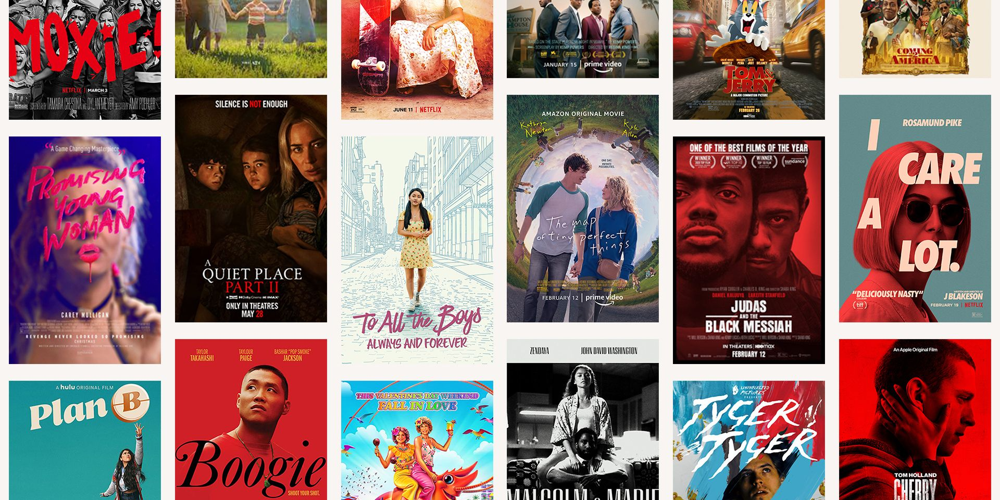

# Phase-1-Project-Repository

# Overview
This project analyzes the 'best', most successful, movies at the boxoffice within recent years. Descriptive analysis of various movie aspects such as genre, director, actor, etc and outcome data shows that franchise movies, comedies and dramas, and directors such as Gerald Thomas, Steven Spilberg, and Steven Quale have lead to the success and popularity of recent boxoffice. Microsoft may use this analysis to aid in their new movie studio's decisions on what movies to create.

# Business Problem

The Microsoft Corporation has decided to join the lucrative market of movie making. Patterns regarding to modern boxoffice hits are depicted in order to aid the Microsoft corporation in creating a successful movie studio and films.

# Data Understanding

IMBD (Internet Movie Database)is an online database of information related to films and other entertainment. Box Office Mojo is an American website that tracks box-office revenue in a systematic, algorithmic way. Rotten Tomatoes is an American review-aggregation website for film and television and The Numbers is a film industry data website that tracks box office revenue in a systematic, algorithmic way. The data files provide information about domestic gross, foreign gross, year of release, directors, movie ratings, writers, and more.

# Data
IMBD (Internet Movie Database)is an online database of information related to films and other entertainment. Box Office Mojo is an American website that tracks box-office revenue in a systematic, algorithmic way. Rotten Tomatoes is an American review-aggregation website for film and television and The Numbers is a film industry data website that tracks box office revenue in a systematic, algorithmic way. The data files provide information about domestic gross, foreign gross, year of release, directors, movie ratings, writers, and more.

# Methods
This project uses descriptive analysis in order to see trends and understand data. 

# Results

The top movies listed from Box Office Mojo are Black Panther, Avengers: Infinity War, Jurassic World, Incredibles 2, and Rogue One: A Star Wars Story.

The majority of movies are either Drama, Comedy, or Comedy/Drama according to Rotten Tomatoes.

The directors with the most movies are Tim Story, Andrzej Bartkowiak, and Steven Quale.

# Conclusions
This analysis leads to three recommendations for Microsoft's new movie studio and their future productions:

According to the Box Office Mojo data the top domestic grossing movies are Black Panther, Avengers: Infinity War, Jurassic World, Incredibles 2, and Rogue One: A Star Wars Story. Therefore I would recommend the Microsoft company invest or manufacture a franchise since franchise movies earn the most at the boxoffice.

According to the Rotten Tomatoes webiste, the most popular genres are comedy and drama or a mix of the two and therefore I would recommend starting with movies that contain comedy, drama or both in order to capture public attention.

One of the most important aspects of movie making is the director who is bringing a creative vision to life. Tim Story, Andrzej Bartkowiak, and Steven Quale would be great picks to direct some of the first movies that the Microsoft company produces in order to ensure quality based on experience.

# Next Steps
Further analyses could yield additional insights to further aid in Microsoft's new studio's decisions:

Predictions from this data about what genre movies or movie budget results in the most profit would be best made by creating models.

Correlations of whether Directors have an influence over the ratings a movie has received.

# For More Information
See the full analysis in the Jupyter Notebook or presentation in this repository.

For additional info, contact Rachael Bryant at Rachaelbryant@flatironschool.com

# Repository Structure
├── code
│   ├── __init__.py
│   ├── data_preparation.py
│   ├── visualizations.py
├── data
├── images
├── README.md
├── Box Office Analysis Project_Presentation.pdf
└── Box Office Analysis Project_analysis.ipynb
